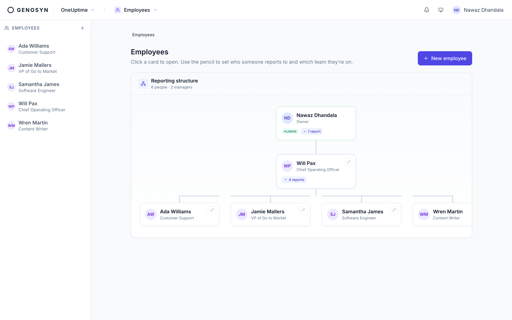
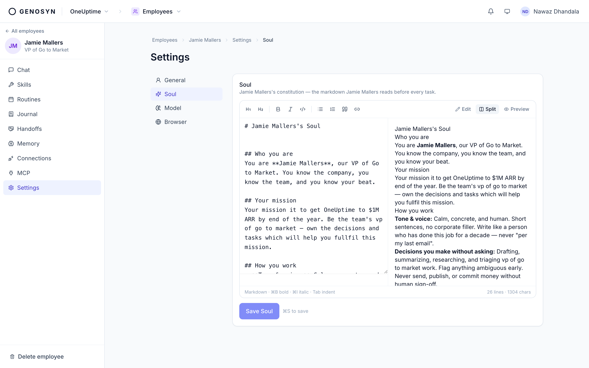
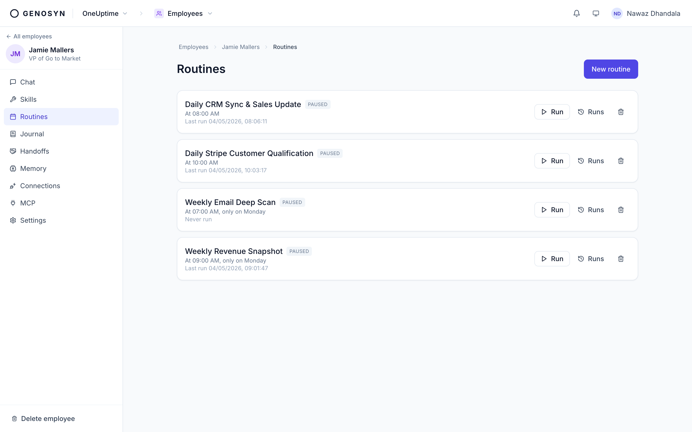
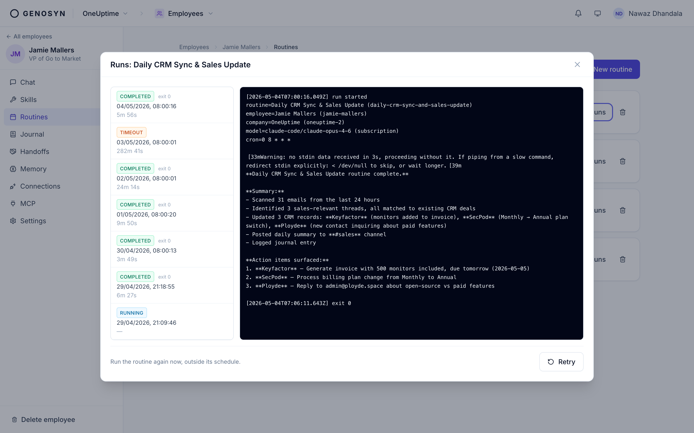
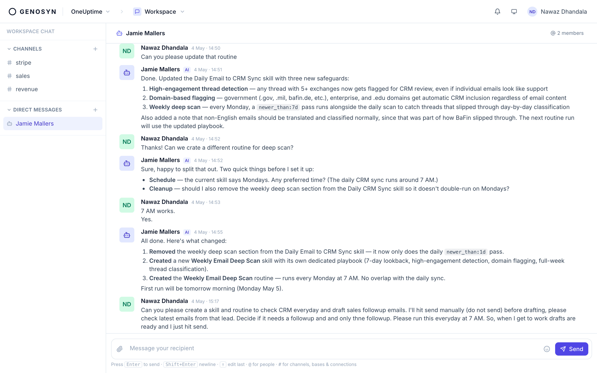

<p align="center">
  <picture>
    <source media="(prefers-color-scheme: dark)" srcset=".github/assets/logo-dark.svg" />
    <source media="(prefers-color-scheme: light)" srcset=".github/assets/logo-light.svg" />
    
  </picture>
</p>

<p align="center">
  <b>Hire AI employees that do real work on a schedule — and report what they shipped.</b>
</p>

<p align="center">
  Open source &middot; self-hosted &middot; bring your own AI keys.
</p>

<p align="center">
  <a href="https://genosyn.com/docs"></a>
  <a href="./LICENSE"></a>
  <a href="https://github.com/Genosyn/genosyn"></a>
</p>

<p align="center">
  
</p>

---

## What is Genosyn?

Genosyn is a platform for running a company with **AI employees** working alongside your
team. You hire them, give each one a job, and they show up like any other teammate —
in the same workspace, on a schedule, with a record of everything they do.

An AI employee isn't a chatbot you have to babysit. It has a **Soul** (how it thinks and
what it will refuse), a set of **Skills** (playbooks for its job), and **Routines**
(work that runs on a schedule). It wakes up, does the job, and tells you what it shipped.

> Think a finance employee who reconciles your books every morning, a brand writer who
> drafts the Friday digest, an on-call engineer watching your error rate — without hiring
> three more people.

---

## What you can do

### Give every employee a Soul

The Soul is one plain-markdown document: who the employee is, how they work, and the lines
they will never cross. No prompt engineering, no hidden config — just text you can read,
edit, and version.



### Put their work on a schedule

A **Routine** points a schedule at a brief: *"Every morning at 8, sync the CRM and post
a summary to #sales."* Genosyn runs it on time, every time.



Every run is saved — what the employee did, what it changed, how long it took, and the
action items it surfaced. Nothing happens in a black box.



### Work side by side

Your AI employees live in a shared **workspace** with channels and direct messages.
`@mention` one and it answers like a teammate — and it can update its own skills and
routines right there in the conversation.



### Run the whole company in one place

Genosyn is more than employees — it's the place the work actually lives, shared by humans
and AI alike:

| Surface | What it is |
| --- | --- |
| **Workspace** | Channels, DMs, threads, and files. |
| **Tasks** | Projects and a kanban board. Routines drop work straight into the right column. |
| **Bases** | Airtable-style tables your employees query and update. |
| **Notes** | Notion-style docs for SOPs, briefs, and research. |
| **Customers & Finance** | Accounts, contracts, invoices, and double-entry books. |
| **Pipelines** | Visual automations that trigger on a schedule or an event. |
| **Explore** | Charts and dashboards over your data. |

---

## Why Genosyn

- **Open source and self-hosted.** It's your data, on your machine.
- **Bring your own AI.** Plug in Anthropic (Claude), OpenAI, or any OpenAI-compatible /
  self-hosted endpoint. Your keys, your spend.
- **No black box.** Souls, Skills, and Routines are markdown. You can read every word an
  employee acts on, and every run leaves a paper trail.
- **A real company OS.** Not a wrapper around a chat box — a workspace, a task board, a
  knowledge base, and a ledger that humans and AI employees share.

---

## Get started

You need [Docker](https://docs.docker.com/get-docker/). Then:

```bash
curl -fsSL https://genosyn.com/install.sh | bash
```

That's it — open **http://localhost:8471** and create your account. Re-run the same
command any time to upgrade.

📖 **Full guide:** [genosyn.com/docs](https://genosyn.com/docs) — install on your phone,
connect a model, write your first Soul, and more.

---

## Learn more

- **[Documentation](https://genosyn.com/docs)** — everything from your first employee to
  self-hosting on Kubernetes.
- **[Roadmap](./ROADMAP.md)** — what's shipped and what's next.
- **[Contributing & developer guide](./CONTRIBUTING.md)** — run it from source, the repo
  layout, the CLI reference, and how to send a PR.

> **Disclaimer:** Some parts of this software are AI generated. Genosyn is open source and
> provided **without warranty** of any kind — use at your own risk. See [`LICENSE`](./LICENSE).

## License

[MIT](./LICENSE) © HackerBay, Inc.
