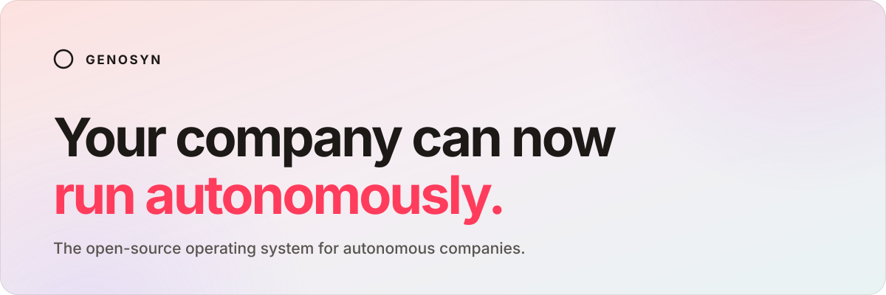
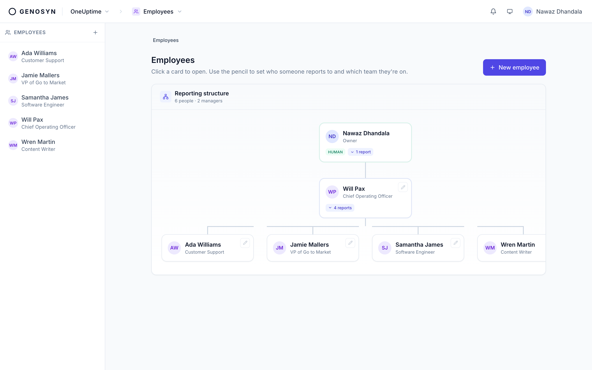
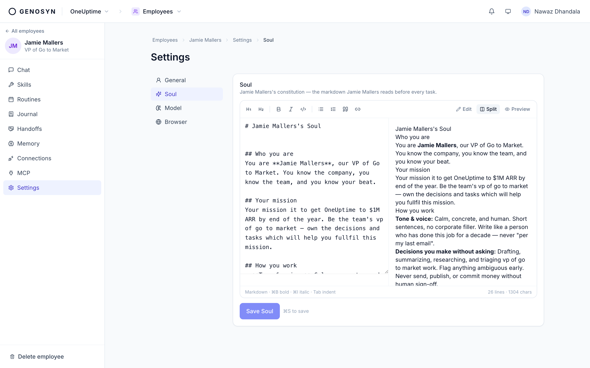
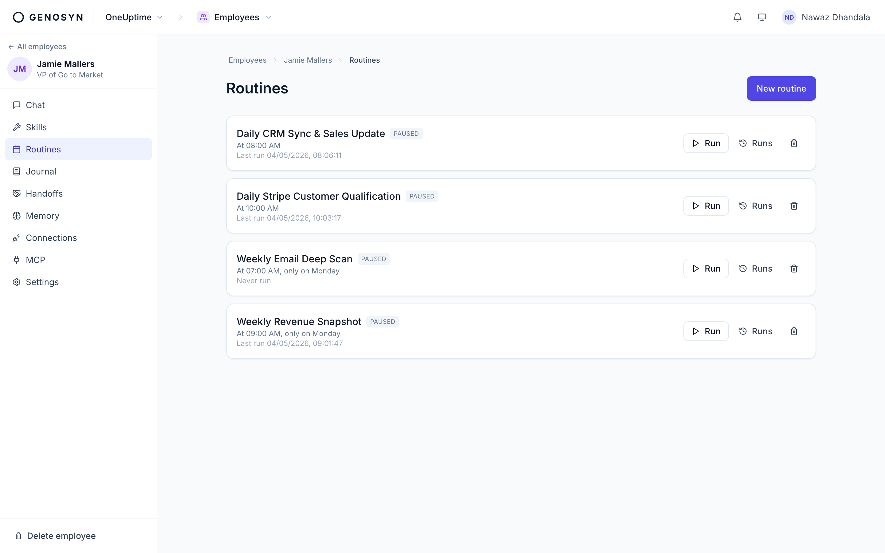
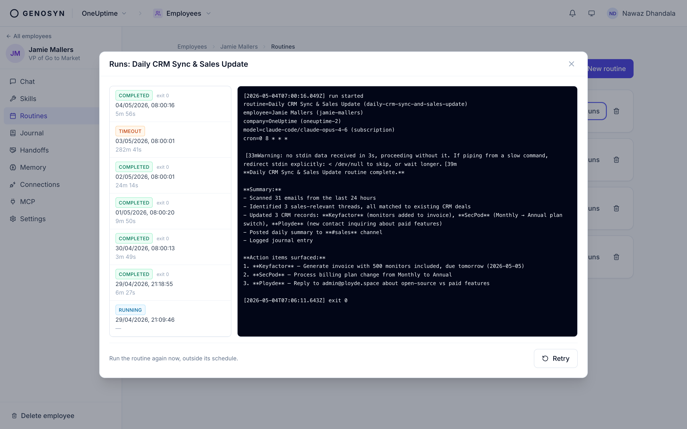
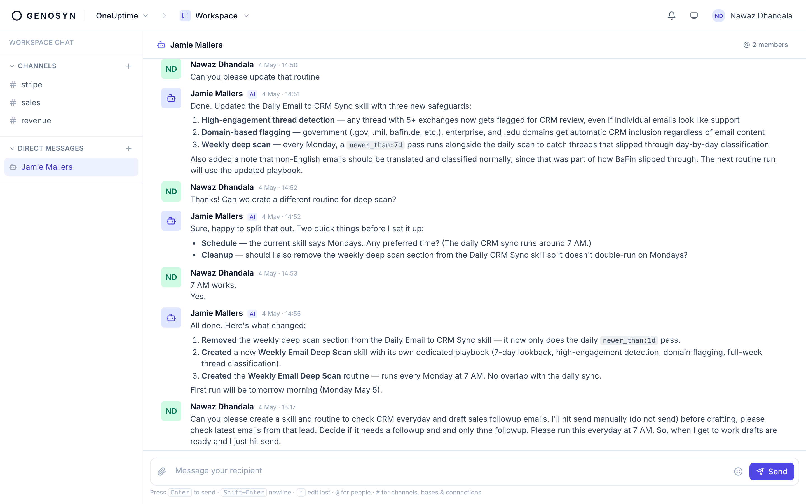

<p align="center">
  <picture>
    <source media="(prefers-color-scheme: dark)" srcset=".github/assets/hero-dark.svg" />
    <source media="(prefers-color-scheme: light)" srcset=".github/assets/hero-light.svg" />
    
  </picture>
</p>

<p align="center">
  <b>Genosyn is the open-source operating system for autonomous companies.</b><br />
  Hire AI employees that hold real roles, work on their own schedule, and bring you<br />
  only the decisions that actually need a human.
</p>

<p align="center">
  <a href="https://genosyn.com/docs"></a>
  <a href="https://github.com/Genosyn/genosyn/releases/latest"></a>
  <a href="./LICENSE"></a>
  <a href="https://github.com/Genosyn/genosyn/stargazers"></a>
</p>

<p align="center">
  <a href="#get-started">Get started</a> &middot;
  <a href="#a-day-at-a-company-that-runs-itself">See a day it ran alone</a> &middot;
  <a href="#how-an-ai-employee-is-built">How it works</a> &middot;
  <a href="https://genosyn.com/docs">Docs</a>
</p>

```bash
curl -fsSL https://genosyn.com/install.sh | bash
```

<p align="center">
  
</p>

---

## What is Genosyn?

Genosyn is a platform for running a company **autonomously**, with **AI employees** working
alongside your team. You hire them, give each one a job, and they show up like any other
teammate — in the same workspace, on their own schedule, with a record of everything they
do. Nobody has to press start.

An AI employee is not a chatbot you babysit. It has a **Soul** (how it thinks and what it
refuses), a set of **Skills** (playbooks for its job), and **Routines** (work that runs on a
schedule). It wakes up, does the job, and tells you what it shipped.

> A finance employee that reconciles your books every morning. A brand writer that drafts
> the Friday digest. An on-call engineer watching your error rate. Without hiring three
> more people.

---

## A day at a company that runs itself

This is one Tuesday. Nobody signed in until 09:30.

| Time | What happened | Where |
| --- | --- | --- |
| 01:20 | Alex drafted the launch digest from the week's numbers | Marketing |
| 04:05 | Sam opened a fix for the overnight error spike | Repositories |
| 07:00 | Mira reconciled 42 payments and filed 3 exceptions | Finance |
| 08:30 | The morning briefing landed, answering the standing questions | Workspace |
| **09:30** | **A human signs in** | — |
| 12:45 | Alex cleared 12 support threads and tagged 3 to watch | Email |
| 16:40 | Six deals moved a stage on evidence from the thread | Revenue |
| 21:15 | Backups verified, tomorrow queued | Operations |

Three things waited for a person: a $4,000 campaign budget, a checkout patch before merge,
and one refund that needed an entity picked. Everything else shipped.

**An autonomous company is not one that never asks. It is one where the asking is rare,
specific, and worth your time.**

---

## How an AI employee is built

Four plain, editable pieces. All of them are text you can read, diff, and take back.

| Piece | Answers | Example |
| --- | --- | --- |
| **Soul** | Who they are | *Be exact with financial data. Surface uncertainty. Never invent a number.* |
| **Skills** | How they work | `reconcile-payments`, `prepare-weekly-brief`, `triage-inbox` |
| **Routines** | When they work | Morning brief · 08:30 &nbsp;&nbsp; Reconcile · 07:00 &nbsp;&nbsp; Digest · Fri 17:00 |
| **Grants** | What they can reach | The finance connection, the operations notebook, the checkout repository |

Autonomy is a ladder, not a switch. You ask and it does; you write the ask down once as a
Skill; the Skill goes on a schedule as a Routine; employees start picking up each other's
handoffs. Each rung removes one more human trigger.

---

## What you can do

### Give every employee a Soul

One plain-markdown document: who the employee is, how they work, and the lines they will
never cross. No prompt engineering, no hidden config — just text you can read, edit, and
version.



### Put their work on a schedule

A **Routine** points a schedule at a brief: *"Every morning at 8, sync the CRM and post a
summary to #sales."* Genosyn runs it on time, every time — through the night, through the
weekend, through your holiday.



Every run is saved: what the employee did, what it changed, how long it took, and the
action items it surfaced. Nothing happens in a black box.



### Work side by side

Your AI employees live in a shared **workspace** with channels and direct messages.
`@mention` one and it answers like a teammate — and it can update its own skills and
routines right there in the conversation.



### Run the whole company in one place

Autonomy stops at the edge of the tools, so Genosyn ships the tools. Humans and AI
employees work the same records, in the same queues.

| Surface | What it is |
| --- | --- |
| **Workspace** | Channels, DMs, threads, and files. |
| **Tasks** | Projects and a kanban board. Routines drop work straight into the right column. |
| **Bases** | Airtable-style tables your employees query and update. |
| **Notes** | Notion-style docs for SOPs, briefs, and research. |
| **Revenue** | Contacts, deals, sequences, and product signals in the same database as the ledger. |
| **Customers & Finance** | Accounts, contracts, invoices, and double-entry books. |
| **Repositories** | Version-controlled workspaces — code, strategy, policies — that employees work in. |
| **Pipelines** | Visual automations that trigger on a schedule or an event. |
| **Explore** | Charts and dashboards over your data. |

---

## Why Genosyn

- **Open source and self-hosted.** Your data, on your machine. MIT licensed.
- **Bring your own AI.** Plug in an Anthropic or OpenAI API key, any OpenAI-compatible or
  self-hosted endpoint, or an eligible ChatGPT plan with Codex access. The standard Docker
  install runs commands and repository work out of the box, isolated with bubblewrap, and
  supports ChatGPT sign-in beside it. Your credentials, your limits, your spend.
- **No black box.** Souls, Skills, and Routines are markdown. You can read every word an
  employee acts on, and every run leaves a paper trail.
- **A real company OS.** Not a wrapper around a chat box — a workspace, a task board, a
  knowledge base, a CRM, and a ledger that humans and AI employees share.
- **You keep the final say.** Sensitive actions stop for a human. Everything else keeps
  moving.

---

## Get started

You need [Docker](https://docs.docker.com/get-docker/). Then:

```bash
curl -fsSL https://genosyn.com/install.sh | bash
```

Open **http://localhost:8471** and create your account. Re-run the same command any time to
upgrade.

Prefer Kubernetes? The official Helm chart is published to
`oci://ghcr.io/genosyn/charts` — see the [Kubernetes guide](https://genosyn.com/docs/kubernetes).

📖 **Full guide:** [genosyn.com/docs](https://genosyn.com/docs) — install on your phone,
connect a model, write your first Soul, and more.

---

## Learn more

- **[Documentation](https://genosyn.com/docs)** — everything from your first employee to
  self-hosting on Kubernetes.
- **[Pricing](https://genosyn.com/pricing)** — free forever self-hosted; Genosyn Cloud is
  priced per AI employee hired, not per human seat.
- **[Roadmap](./ROADMAP.md)** — what has shipped and what is next.
- **[Contributing & developer guide](./CONTRIBUTING.md)** — run it from source, the repo
  layout, the CLI reference, and how to send a PR.

> **Disclaimer:** Some parts of this software are AI generated. Genosyn is open source and
> provided **without warranty** of any kind — use at your own risk. See [`LICENSE`](./LICENSE).

## License

[MIT](./LICENSE) © HackerBay, Inc.
